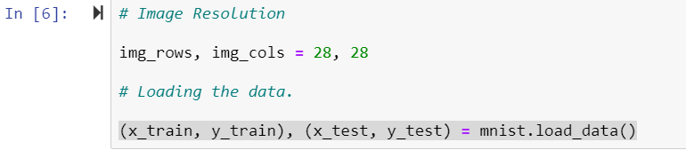

# Image Classification using CNN

A convolutional neural network (CNN) is used for the task of handwriting recognition, as well as most image recognition tasks. The image is first sent through different convolutional layers, where the features are extracted and identified by the neurons. Whenever the network encounters a pattern in the test set which has features similar to the ones it learned in training, it will classify that image to the corresponding output label.

Let's implement the algorithm using the Keras deep learning framework, which I've done in 8 steps.

## Step 1: Importing Necessary Modules and Layers

This neural network is implemented in Keras (this comes pre-installed on Paperspace, but if you're running this locally you can always install Keras from your command line with pip install Keras). Next, we import the model and layers which we will use for building the neural network architecture, which in this case is a CNN.

 

## Step 2: Defining Hyperparameters

Choosing the hyperparameters for your network can be a challenging task. Without going into too much theory or testing many different values, here we use standard values for the batch size (which defines the number of training samples to work through before updating the model weights) and number of epochs (full presentations of the data in the training set for learning). There are 10 classes since we're considering the digits 1-10.

## Step 3: Loading the Images
The next step is to load our data set and set constant image sizes for our training process. The images sizes are fixed to (28 x 28), as the network input parameters are always constant.

## Step 4: Data Pre-Processing

In this step we need to make sure that the training data is pre-processed and tuned to the same direction; if your inputs are of different sizes, the performance of your network will be inaccurate. We use a simple reshape method on every image and iterate it over the complete data set. Next, we assign the respected label to every image for the training process, in this case, we use the to_categorical method to assign a label to every image.

## Step 5: Defining the Architecture

With the Keras framework we can easily declare a model by sequentially adding the layers. We use the add() method for this.

## Step 6: The Training Loop

Next we fit the model with the declared hyperparameters and initiate the training process. This can be simply done by using the model.fit() method and passing the parameters.

## Step 7: Evaluating the Model

## Step 8: Saving the Model

### Upon running this program and successful training, you will find two files in the same directory:

#### 1) model.json
#### 2) model.h5

The model.h5 file is a binary file which holds the weights. The file model.json is the architecture of the model that you just built.

## Saving Trained Models With h5py
The HDF5 library lets users store huge amounts of numerical data. The save_weights method is added above in order to save the weights learned by the network using h5py. The h5py package is a Pythonic interface to the HDF5 binary data format.

Now that we have saved our model in HDF5 format we can load the weights whenever we want, and apply it to future tasks. To load the weights we'll also need to have the corresponding model architecture defined. 
This is done from a JSON file we previously used. Once the model is prepared with the trained weights, we're ready to use it for inference.

Now that we have the model saved along with the weights learned from training, we can use them to do inference on new data. This is how we make our trained models reusable.

## Creating a Flask App for Serving the Model
To serve the saved model we'll use Flask, a micro web framework written in Python (it's referred to as a "micro" framework because it doesn't require particular tools or libraries).

To create our web app that recognizes different handwritten digits, we need two routes on our flask app:

1) An index page route for the users drawing the image
2) A predict route to make inferences from our saved model

The above two routes are used implement our complete app.py

Here we have the loader function, load.py:

An interface which enables users to draw images from the browser is created. We'll use JavaScript and render a canvas on the HTML page. 

At the end of this project, your directory structure should look like this:

